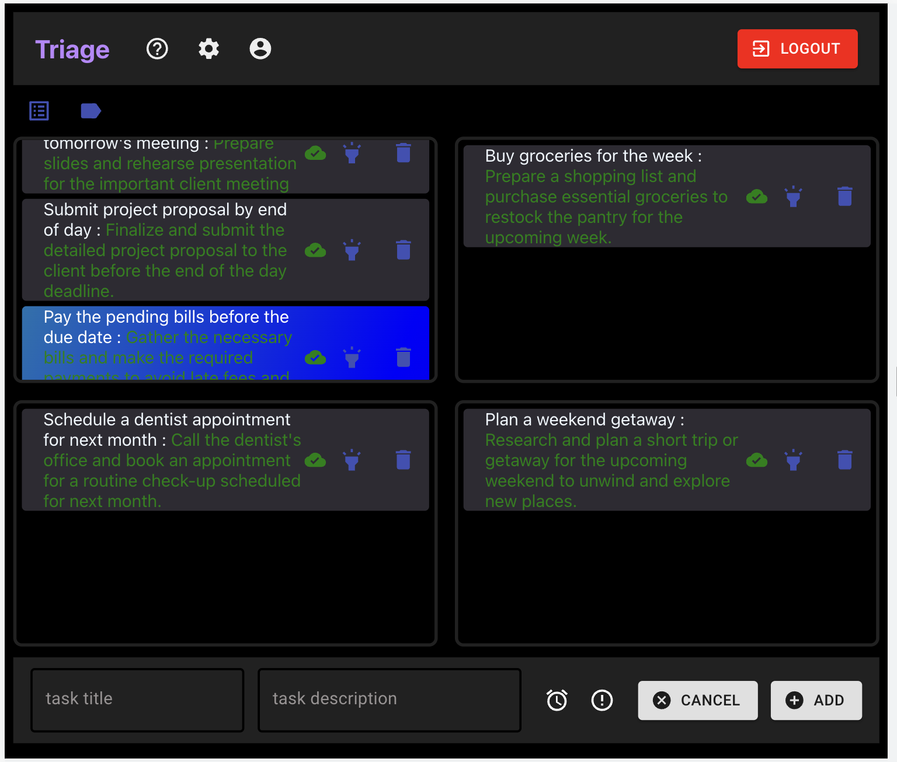
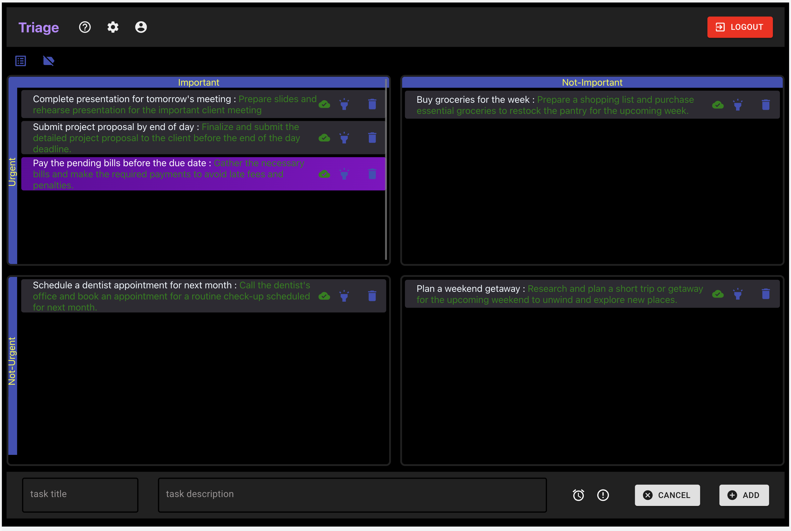

This project was bootstrapped with [Create React App](https://github.com/facebook/create-react-app).

# Triage (MyScheduler)

- Designed and developed a user-friendly drag-and-drop interface, uniquely tailored to optimize productivity through the Eisenhower Matrix, fostering intuitive task prioritization.
- Leveraged technologies including React.js, Redux, and Firebase to architect a robust and scalable solution.
- Engineered the application as a Progressive Web App (PWA), ensuring a native app-like experience across devices while enabling offline functionality.




## icons used from
- Material UI icons : https://mui.com/components/material-icons/

## depolyed at

- Netlify : https://myscheduler.netlify.app/    
- Firebase Hosting : https://myscheduler-c8f00.web.app/

## Available Scripts

### deploy to Netlify

> npm run build  
> npm install netlify-cli -g  

- Now you need to create a `/build/_redirects` file for redirecting all requests to `index.html` for React client-side routing
- /build/_redirects>>>>
    ```
    /*  /index.html
    ```
    > netlify deploy  
- or for directly on production...
    > netlify deploy --prod  
    - select `./build` folder

### deploy to Firebase hosting

> npm run build     
> sudo npm install -g firebase-tools    
> firebase login    
> firebase init     
> firebase deploy   
    - select `./build` file and select redirect all requests to `index.html`    
